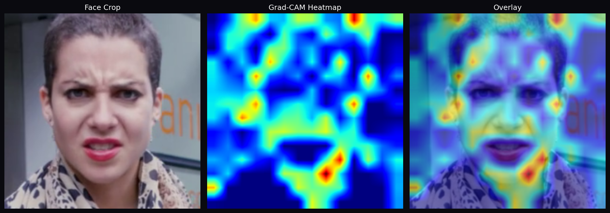

# 🛡️ DeepShield — AI Deepfake Detection System

> Real-time deepfake video detection using Vision Transformer (ViT) + Grad-CAM explainability


---

## 📸 Demo



---

## 🎯 What Is DeepShield?

DeepShield is a full-stack AI-powered deepfake detection system.
It analyzes videos frame by frame, detects face regions using OpenCV,
runs each face through a fine-tuned Vision Transformer model,
and highlights suspicious regions using Grad-CAM explainability.

---

## ✨ Features

- 🎬 **Drag & Drop Upload** — supports MP4, AVI, MOV, MKV
- 👤 **Face Detection** — OpenCV Haar Cascade crops faces before analysis
- 🧠 **Vision Transformer** — ViT-Base/16 with 85M+ parameters
- 🔥 **Grad-CAM** — heatmap shows exactly which facial regions look fake
- 📊 **Frame Timeline** — frame-by-frame fake probability graph
- 💾 **History** — SQLite database saves all past analyses
- ⚡ **GPU Accelerated** — CUDA inference on NVIDIA RTX 3050

---

## 🏆 Model Performance

| Metric | Value |
|--------|-------|
| Validation Accuracy | **96.9%** |
| Training Dataset | 1,289 face images |
| Model Architecture | ViT-Base/16 |
| Total Parameters | 85M+ |
| Inference Device | NVIDIA RTX 3050 (CUDA) |
| Training Time | ~30 minutes |

---

## 🛠️ Tech Stack

| Layer | Technology |
|-------|-----------|
| Frontend | React 19 + Vite 7 |
| Backend | FastAPI + Python 3.13 |
| AI Model | PyTorch 2.6.0 + ViT-Base/16 |
| Face Detection | OpenCV Haar Cascade |
| Explainability | Grad-CAM |
| Database | SQLite |
| GPU | CUDA 12.7 + NVIDIA RTX 3050 |

---

## 🚀 How to Run Locally

### Prerequisites
- Python 3.13
- Node.js 18+
- NVIDIA GPU with CUDA (optional but recommended)

### 1. Clone the repo
```bash
git clone https://github.com/nickhill06/Deepshield01.git
cd Deepshield01
```

### 2. Create virtual environment
```bash
python -m venv venv
venv\Scripts\activate
```

### 3. Install Python dependencies
```bash
pip install torch torchvision torchaudio --index-url https://download.pytorch.org/whl/cu124
pip install fastapi uvicorn python-multipart aiofiles
pip install timm opencv-python pandas scikit-learn
pip install matplotlib seaborn tqdm albumentations grad-cam
```

### 4. Run Backend (Terminal 1)
```bash
python api.py
```
API will start at: `http://localhost:8000`

### 5. Run Frontend (Terminal 2)
```bash
cd frontend
npm install
npm run dev
```
Website will open at: `http://localhost:5173`

---

## 📁 Project Structure
```
Deepshield01/
│
├── src/
│   ├── model.py              # ViT-Base/16 model architecture
│   ├── dataset.py            # Dataset loading utilities
│   ├── train.py              # Initial training script
│   ├── train_video.py        # Retraining on video face dataset
│   ├── predict_video.py      # Video prediction + face detection
│   ├── evaluate.py           # Model evaluation metrics
│   ├── gradcam.py            # Grad-CAM visualization
│   └── haarcascade_frontalface_default.xml
│
├── frontend/
│   └── src/
│       └── App.jsx           # React frontend
│
├── api.py                    # FastAPI backend server
├── README.md
└── .gitignore
```

---

## 🔍 How It Works
```
1. User uploads video via React frontend
       ↓
2. FastAPI backend receives the video
       ↓
3. OpenCV extracts frames (every 4-5th frame)
       ↓
4. Haar Cascade detects and crops face regions
       ↓
5. ViT-Base/16 analyzes each face crop
       ↓
6. Majority voting determines FAKE or REAL
       ↓
7. Grad-CAM generates heatmap of suspicious regions
       ↓
8. Result sent back to frontend with confidence score
```

---

## 📊 API Endpoints

| Method | Endpoint | Description |
|--------|----------|-------------|
| GET | `/` | Health check |
| POST | `/api/predict` | Upload video for analysis |
| GET | `/api/history` | Get all past predictions |
| GET | `/api/history/{id}` | Get specific prediction |
| GET | `/docs` | Interactive API documentation |

---

## 🧠 Model Architecture
```
Input Video
    ↓
Face Detection (OpenCV Haar Cascade)
    ↓
Face Crop (224×224)
    ↓
ViT-Base/16 Backbone (frozen)
    ↓
Custom Classifier Head
    Linear(768 → 256) + ReLU + Dropout(0.5)
    Linear(256 → 2)
    ↓
Softmax → Fake Probability
    ↓
Majority Voting across frames
    ↓
FAKE / REAL Verdict
```

---

## 📈 Training Results
```
Epoch 01 → Val: 85.7%
Epoch 05 → Val: 95.0%
Epoch 08 → Val: 96.5%
Epoch 11 → Val: 96.9% ← Best model saved
Epoch 20 → Val: 96.9%

Final Accuracy: 96.9% ✅
```

---

## 👨‍💻 Author

**Nikhil** — AI/ML Developer

[](https://github.com/nickhill06)

---

## 📄 License

This project is for educational purposes.
